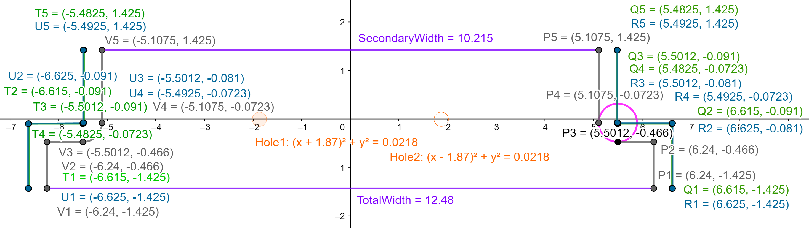
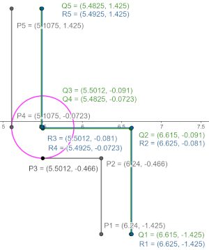
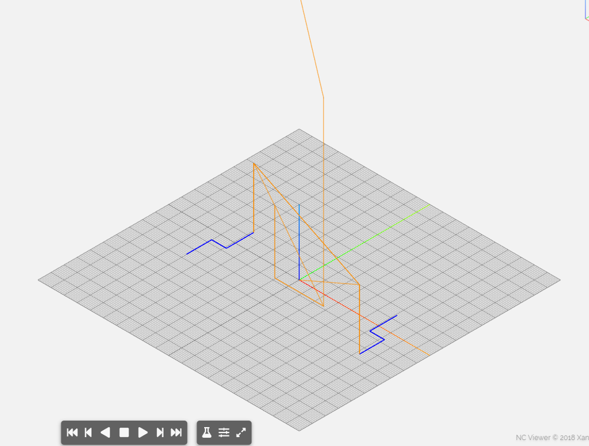

# CNC Workflow

* Scan (or photograph) the plan(s).
* Import photo into GIMP.
* Rotate to straighten the plan.
* Size and/or crop appropriately.
* Export as `.png` file.
* Import into Inkscape or other CAD program.


```python
from copy import deepcopy
from io import StringIO
from math import pi
from pathlib import Path
import sys
```


```python
help(round)
```

    Help on built-in function round in module builtins:
    
    round(number, ndigits=None)
        Round a number to a given precision in decimal digits.
        
        The return value is an integer if ndigits is omitted or None.  Otherwise
        the return value has the same type as the number.  ndigits may be negative.
    
    


```python
from IPython.display import Image
from mecode import G
import numpy as np
import re
```


```python
CONV_FACTOR = 0.039370

def in2mm(n):
    return n / CONV_FACTOR

def mm2in(n):
    return n * CONV_FACTOR
```


```python
Image('Sears22723.png')
```





```python
WIDTH = 12.48
WIDTH2 = 10.215
HEIGHT = 2.85
DRILL = 0.295
MILL_DIA = 0.75
SAFE_Z = 4.0
MILL_Z = -0.6
w = WIDTH / 2
w2 = WIDTH2 / 2
h = HEIGHT / 2
r = mm2in(10)
RADIUS = MILL_DIA / 2
ERR_MARGIN = 0.2
rough = 0.01
START = -h - RADIUS - ERR_MARGIN
END = -START
DIM = 0.959
P1 = np.array([w, START])
P2 = np.array([w, -h + DIM])
P3 = np.array([w2 + r, P2[1]])
P4 = np.array([w2, P3[1] + r])
P5 = np.array([w2, END])
P = np.array([P1,P2,P3,P4,P5])
MASK = np.array([[1,0], [1,1], [0,1], [1,0], [1,0]])
OFFSET = MASK * RADIUS
Q = P + OFFSET
ROUGH = MASK * rough
R = Q + ROUGH
REFLECT = np.array([-1,1])
T = REFLECT * Q
U = REFLECT * R
V = REFLECT * P
CUT_RADIUS = r - RADIUS
ROUGH_RADIUS = CUT_RADIUS - rough
HOLE = 1.87
DEPTH = -0.475
```


```python
Image('Sears22723.2.png')
```





```python
print(f"{P=}\n{OFFSET=}\n{Q=}\n{R=}\n{T=}\n{U=}\n{V=}")
```

    P=array([[ 6.24  , -2.    ],
           [ 6.24  , -0.466 ],
           [ 5.5012, -0.466 ],
           [ 5.1075, -0.0723],
           [ 5.1075,  2.    ]])
    OFFSET=array([[0.375, 0.   ],
           [0.375, 0.375],
           [0.   , 0.375],
           [0.375, 0.   ],
           [0.375, 0.   ]])
    Q=array([[ 6.615 , -2.    ],
           [ 6.615 , -0.091 ],
           [ 5.5012, -0.091 ],
           [ 5.4825, -0.0723],
           [ 5.4825,  2.    ]])
    R=array([[ 6.625 , -2.    ],
           [ 6.625 , -0.081 ],
           [ 5.5012, -0.081 ],
           [ 5.4925, -0.0723],
           [ 5.4925,  2.    ]])
    T=array([[-6.615 , -2.    ],
           [-6.615 , -0.091 ],
           [-5.5012, -0.091 ],
           [-5.4825, -0.0723],
           [-5.4825,  2.    ]])
    U=array([[-6.625 , -2.    ],
           [-6.625 , -0.081 ],
           [-5.5012, -0.081 ],
           [-5.4925, -0.0723],
           [-5.4925,  2.    ]])
    V=array([[-6.24  , -2.    ],
           [-6.24  , -0.466 ],
           [-5.5012, -0.466 ],
           [-5.1075, -0.0723],
           [-5.1075,  2.    ]])
    


```python
g = G()
g.output_digits = 4
```

    G91 ;relative
    


```python
absolute = g.absolute
```


```python
def rapid(P):
    g.abs_rapid(*P)
    
def move(P):
    g.abs_move(*P)
    
def arc(P, r):
    g.abs_arc(x=P[0], y=P[1], radius=r)
    
def ccw(P, r):
    g.abs_arc(x=P[0], y=P[1], radius=r, direction='CCW')
```


```python
[s for s in dir(g) if not s.startswith('_')]
```


    ['abs_arc',
     'abs_move',
     'abs_rapid',
     'absolute',
     'aerotech_include',
     'arc',
     'arc_ijk',
     'baudrate',
     'clip',
     'comment_char',
     'current_position',
     'direct_write',
     'direct_write_mode',
     'dwell',
     'extrude',
     'extrusion_multiplier',
     'extrusion_width',
     'feed',
     'filament_diameter',
     'footer',
     'get_axis_pos',
     'header',
     'home',
     'i_axis',
     'is_relative',
     'j_axis',
     'k_axis',
     'layer_height',
     'lineend',
     'meander',
     'move',
     'out_fd',
     'outfile',
     'output_digits',
     'position_history',
     'print_lines',
     'printer_host',
     'printer_port',
     'rapid',
     'rect',
     'relative',
     'rename_axis',
     'reset_home',
     'retract',
     'set_cal_file',
     'set_home',
     'set_pressure',
     'set_vac',
     'set_valve',
     'setup',
     'speed',
     'speed_history',
     'teardown',
     'toggle_pressure',
     'triangular_wave',
     'two_way_comm',
     'view',
     'write',
     'x_axis',
     'y_axis',
     'z_axis']


```python
cout = sys.stdout
```


```python
sys.stdout = cout
```


```python
round(2036.12345, ndigits=4)
```


    2036.1235


```python
def cut():
    sys.stdout = StringIO()
    absolute()
    # rapid([*R[0], SAFE_Z])
    g.abs_rapid(z=MILL_Z)
    move(R[1])
    move(R[2])
    arc(R[3], ROUGH_RADIUS)
    move(R[4])
    move(Q[4])
    move(Q[3])
    ccw(Q[2], CUT_RADIUS)
    move(Q[1])
    move(Q[0])
    g.abs_rapid(z=SAFE_Z)
    rapid(U[4])
    g.abs_rapid(z=MILL_Z)
    move(U[3])
    arc(U[2], ROUGH_RADIUS)
    move(U[1])
    move(U[0])
    move(T[0])
    move(T[1])
    move(T[2])
    ccw(T[3], CUT_RADIUS)
    move(T[4])
    g.abs_rapid(z=SAFE_Z)
    
    value = [s for s in sys.stdout.getvalue().split('\n') if not re.match(r'G17', s)]
    
    sys.stdout = cout
    
    current_x = R[0][0]
    current_y = R[0][1]
    current_z = SAFE_Z
    ABS_POS = 90
    REL_POS = 91
    RAPID_MOVE = 0
    CUT_MOVE = 1
    ARC_MOVE = 2
    CCW_MOVE = 3
    current_pos_mode = REL_POS
    current_move_mode = RAPID_MOVE
    MOVE_CODES = list(range(3))
    POS_CODES = [90, 91]
    
    words = list()
    for i, s in enumerate(value):
        if s:
            block = list()
            for j, w in enumerate(s.split(' ')):
                mark4del = False
                CMD = w[0]
                CODE = (int if CMD == 'G' else float)(w[1:])
#                 print(f"{CMD=} {CODE=}")
                if CMD == 'G':
                    if CODE in MOVE_CODES:
                        if CODE != current_move_mode:
                            current_move_mode = CODE
                        else:
                            mark4del = True
                    elif CODE in POS_CODES:
                        if CODE != current_pos_mode:
                            current_pos_mode = CODE
                        else:
                            mark4del = True
                elif CMD in {'X', 'x'}:
                    if CODE != current_x:
                        current_x = CODE
                    else:
                        mark4del = True
                elif CMD in {'Y', 'y'}:
                    if CODE != current_y:
                        current_y = CODE
                    else:
                        mark4del = True
                elif CMD in {'Z', 'z'}:
                    if CODE != current_z:
                        current_z = CODE
                    else:
                        mark4del = True

                if not mark4del:
                    block.append(w)
                
            words.append(' '.join(block))

    return ' ;\n'.join(words) + ' ;\n'

S = cut()    

TEETH = 3
SURFACE_SPEED = 1000 # Recommended is 400 - 1000
CHIP_LOAD = 0.005 # Recommended for 3/4" end mill high speed steel cutter and aluminum is 0.003 - 0.011

MILL_SPEED = int(round((SURFACE_SPEED * 12) / (pi * MILL_DIA))) # Twice the recommended value for surface speed of 200 (?)
MILL_FEED = round(MILL_SPEED * TEETH * CHIP_LOAD, ndigits=4)
DRILL_SPEED = 1600
DRILL_FEED = 8.0
DRILL_CYCLE = f"G99 G81 X{-HOLE} Y0.0 Z{DEPTH} F{DRILL_FEED} R{ERR_MARGIN} ;\nX{HOLE} ;\nG80 ;\n"

output = f"""%
O2273 ;
G90 G80 G40 G17 G00 ;
G91 G30 Z0.0 Y0.0 ;
T04 ;
M06 ;
S{MILL_SPEED} F{MILL_FEED} M03 ;
M08 ;
G90 G54 G43 H04 X{R[0][0]} Y{R[0][1]} Z{SAFE_Z} ;
""" + S + f"""G90 G55 G43 H06 X{R[0][0]} Y{R[0][1]} Z{SAFE_Z} ;
""" + S + f"""M05 ;
M09 ;
G91 G30 Z0.0 Y0.0 ;
T05 ;
M06 ;
S{DRILL_SPEED} F{DRILL_FEED} M03 ;
M08 ;
G90 G54 G43 H05 X{-HOLE} Y0.0 Z{SAFE_Z} ;
""" + DRILL_CYCLE + f"""G90 G55 G43 H07 X{-HOLE} Y0.0 Z{SAFE_Z} ;
""" + DRILL_CYCLE + f"""M05 ;
M09 ;
G00 Z13.0 ;
X-6.0 Y6.0 ;
M30 ;
%
"""

print(output)
Path('22723.gcode').write_text(output)
```

    %
    O2273 ;
    G90 G80 G40 G17 G00 ;
    G91 G30 Z0.0 Y0.0 ;
    T04 ;
    M06 ;
    S5093 F76.395 M03 ;
    M08 ;
    G90 G54 G43 H04 X6.625 Y-2.0 Z4.0 ;
    Z-0.6000 ;
    G1 Y-0.0810 ;
    X5.5012 ;
    G2 X5.4925 Y-0.0723 R0.0087 ;
    G1 Y2.0000 ;
    X5.4825 ;
    Y-0.0723 ;
    G3 X5.5012 Y-0.0910 R0.0187 ;
    X6.6150 ;
    Y-2.0000 ;
    G0 Z4.0000 ;
    X-5.4925 Y2.0000 ;
    Z-0.6000 ;
    G1 Y-0.0723 ;
    G2 X-5.5012 Y-0.0810 R0.0087 ;
    G1 X-6.6250 ;
    Y-2.0000 ;
    X-6.6150 ;
    Y-0.0910 ;
    X-5.5012 ;
    G3 X-5.4825 Y-0.0723 R0.0187 ;
    Y2.0000 ;
    G0 Z4.0000 ;
    G90 G55 G43 H06 X6.625 Y-2.0 Z4.0 ;
    Z-0.6000 ;
    G1 Y-0.0810 ;
    X5.5012 ;
    G2 X5.4925 Y-0.0723 R0.0087 ;
    G1 Y2.0000 ;
    X5.4825 ;
    Y-0.0723 ;
    G3 X5.5012 Y-0.0910 R0.0187 ;
    X6.6150 ;
    Y-2.0000 ;
    G0 Z4.0000 ;
    X-5.4925 Y2.0000 ;
    Z-0.6000 ;
    G1 Y-0.0723 ;
    G2 X-5.5012 Y-0.0810 R0.0087 ;
    G1 X-6.6250 ;
    Y-2.0000 ;
    X-6.6150 ;
    Y-0.0910 ;
    X-5.5012 ;
    G3 X-5.4825 Y-0.0723 R0.0187 ;
    Y2.0000 ;
    G0 Z4.0000 ;
    M05 ;
    M09 ;
    G91 G30 Z0.0 Y0.0 ;
    T05 ;
    M06 ;
    S1600 F8.0 M03 ;
    M08 ;
    G90 G54 G43 H05 X-1.87 Y0.0 Z4.0 ;
    G99 G81 X-1.87 Y0.0 Z-0.475 F8.0 R0.2 ;
    X1.87 ;
    G80 ;
    G90 G55 G43 H07 X-1.87 Y0.0 Z4.0 ;
    G99 G81 X-1.87 Y0.0 Z-0.475 F8.0 R0.2 ;
    X1.87 ;
    G80 ;
    M05 ;
    M09 ;
    G00 Z13.0 ;
    X-6.0 Y6.0 ;
    M30 ;
    %
    
    


    1152


[NCViewer](http://ncviewer.com)


```python
Image('22723.scr.ncv.png')
```





[Cutting Speeds for High-Speed Steel Milling Cutters](https://smithy.com/machining-reference/milling/page/12)

[Milling Cutter Rotational Speeds](https://smithy.com/machining-reference/milling/page/13)

[Chip Sizes Per Tooth for Various Milling Cutters](https://smithy.com/machining-reference/milling/page/14)

[Speeds and Feeds](https://en.wikipedia.org/wiki/Speeds_and_feeds#cite_note-9)

[Feed Rate Formula](https://en.wikipedia.org/wiki/Speeds_and_feeds#Formula_to_determine_feed_rate)
